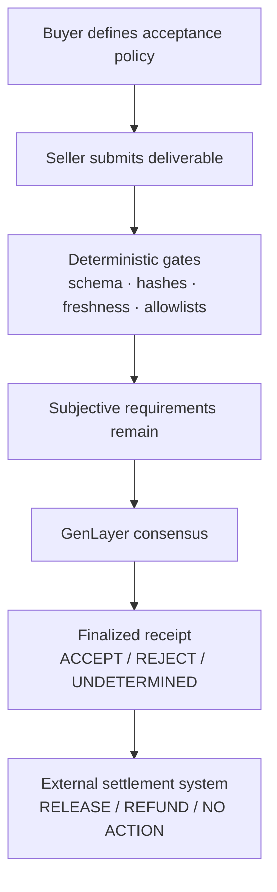

# EOD

EOD turns subjective work acceptance into a finalized onchain receipt that payment systems can act on.

[Live App](https://eodyn.vercel.app) · [Evidence](docs/E2E-EVIDENCE.md) · [How it works](#how-eod-works)

## The problem

Every agent job eventually reaches the same question: did the work actually meet the brief?

Deterministic systems verify schema, hashes, freshness, allowlists, and other objective requirements. They cannot cleanly determine whether a deliverable genuinely satisfies subjective written requirements.

Today that judgment may sit with the buyer, a platform backend, one LLM, or a human reviewer. Each option is slow, private, or easy for the judged party to bypass. EOD creates a shared acceptance layer instead.

## How EOD works

The buyer defines what "done" means before judgment. Objective failures are handled deterministically first. Only the subjective remainder goes to GenLayer consensus. The finalized verdict is `ACCEPT`, `REJECT`, or `UNDETERMINED`.



## Proven end to end

A browser wallet created `job-5` through the live app. GenLayer evaluated it. An external escrow released on the receipt.

| Step                | Result            |
| ------------------- | ----------------- |
| Browser create      | Finalized         |
| Submit              | Finalized         |
| GenLayer evaluation | ACCEPT            |
| Receipt             | `job-5:v1:ACCEPT` |
| Escrow              | 0.01 ETH          |
| Settlement          | RELEASE           |
| Seller delta        | +0.010 ETH        |

The full hash trail, balance proof, and finality record are in [docs/E2E-EVIDENCE.md](docs/E2E-EVIDENCE.md).

## Why GenLayer

Without GenLayer, the subjective acceptance decision returns to one private reviewer, model, backend, or party. That is a different trust model: a single opinion instead of a shared verdict.

EOD uses deterministic code for what deterministic code can decide. That part needs no consensus and spends no LLM calls. GenLayer handles the part that actually requires judgment: independent validators re-judge the evidence against the same criteria and must agree exactly before the receipt finalizes.

## Use cases

### Agent marketplaces

Settle autonomous jobs against shared acceptance rules.

### Bounties and contributor work

Turn qualitative completion requirements into a verdict payment rails can consume.

### Agent orchestration

Let one system commission another without either side being the sole judge of success.

## Architecture

* Web app and browser wallet: buyers define policies and sign `create_job` through MetaMask with a fee quote from the measured profile.
* Acceptance Intelligent Contract (`contracts/acceptance.py`): owns policy, evidence envelope, deterministic gates, and the consensus verdict. Holds no funds.
* GenLayer consensus (studio-dev, chain ID 61997): validators independently re-judge subjective criteria; exact agreement finalizes the receipt.
* External escrow (`evm/SpikeEscrow.sol` on Base Sepolia): buyer-funded; arbiter-only release/refund driven by finalized receipts.
* Relayer scripts (`scripts/`): submit, evaluate, and settle with every action gated on FINALIZED plus `FINISHED_WITH_RETURN` plus exact receipt match.
* Evidence layer (`docs/E2E-EVIDENCE.md`, `data/fixtures.json`): every fund movement recorded with txids and balances.

**GenLayer produces the verdict. It does not hold the escrowed ETH.** Settlement is executed by an external contract acting on the finalized receipt.

Networks:

* GenLayer: studio-dev, chain ID 61997. Acceptance v9: `0xFB388b8213a8Ac809B212E879E62e103F6d7767b`
* Settlement: Base Sepolia. Escrow addresses are per-fixture; see the evidence doc.

## Product walkthrough

The live app at https://eodyn.vercel.app offers three views.

### Create

Define acceptance criteria in plain language and review the generated policy JSON. This is the browser-operated path proven by job-5: connect a wallet, review the fee quote, sign `create_job`.

### Track

Follow any studio-dev transaction through submitted, decided, and finalized, with execution result and fee accounting.

### History

Inspect verified ACCEPT, deterministic gate rejection, and REJECT/refund paths with receipts and explorer links.

The proven job-5 ceremony was browser-created, then completed through the existing agent and script path for submit, evaluate, and settlement. That split remains the current architecture: the browser panel covers creation, and scripts drive the remaining lifecycle steps against the same contract.

## Verified behavior

Sourced from `scripts/day2_state.json` and `data/fixtures.json` on Acceptance v9:

| Fixture | Verdict | Receipt | Settlement |
|---|---|---|---|
| pass (job-1) | ACCEPT | `job-1:v1:ACCEPT` | RELEASE |
| structural (job-2) | gate rejection | none (stopped pre-consensus) | none |
| semantic (job-3) | REJECT | `job-3:v1:REJECT` | REFUND |
| ambiguous (job-4) | REJECT | `job-4:v1:REJECT` | REFUND |
| browser job-5 | ACCEPT | `job-5:v1:ACCEPT` | RELEASE |

## Run locally

App only (no secrets required; the deployed frontend configures no environment variables):

```text
git clone https://github.com/unifyWeb3/eod.git
cd eod
npm install
npm run build
npm start -- -p 3101
open http://localhost:3101
```

Contracts and lifecycle scripts (needs local keys and testnet funds; never commit `.env`):

```text
python3 -m venv .venv && .venv/bin/pip install \
  "genlayer-py==0.19.0rc2" "genlayer-test==0.30.0rc2" "genvm-linter==0.11.1rc2"
cp .env.example .env   # fill privately; .env is git-ignored
```

GenLayer writes need studio-dev GEN from the Studio faucet and a matching `studio-dev` chain configuration. Escrow flows need Base Sepolia ETH. No step touches mainnet.

## Repository structure

```text
app/          Next.js product UI (landing, /app workflow, jobs API)
components/   product and workflow components
contracts/    Acceptance Intelligent Contract
evm/          external settlement contract
lib/          GenLayer, fee and policy logic
scripts/      reproducible lifecycle runners plus txid state
tests/        timeout/policy regression tests
docs/         evidence and runbooks
```

## Testing and verification

* Node tests: 12/12 (`tests/fees-phase-timeout.test.mjs`, `tests/policy-builder.test.mjs`)
* Next.js production build with type checking: clean
* `genvm-linter` on the Acceptance contract: clean
* Forge offline compile of the escrow: clean
* Live verification is recorded per fixture in `docs/E2E-EVIDENCE.md`, including the rule that a receipt counts only when FINALIZED with `FINISHED_WITH_RETURN`

## Known limitations

* Testnet software only. Nothing here is production-ready or audited.
* `UNDETERMINED` exists in the contract and the settlement logic, but validators have resolved every ambiguity decisively so far, so no live UNDETERMINED settlement has been demonstrated.
* Settlement currently executes through the operator key under strict receipt gating. The allowlisted relayer set in `docs/relayer-allowlist.md` is a written design, not built functionality.
* The browser UI covers job creation directly; submit, evaluate, and settlement run through the documented scripts.
* EOD judges only what its acceptance inputs expose. It makes no claim of detecting offchain cheating or fraud beyond the submitted evidence.

## Evidence and docs

* [docs/E2E-EVIDENCE.md](docs/E2E-EVIDENCE.md): every verified fund movement with txids, balances, and finality
* [docs/demo-runbook.md](docs/demo-runbook.md): recorded demo plan for the canonical job-5 story
* [docs/e2e-runbook.md](docs/e2e-runbook.md): how to re-run the browser E2E
* [docs/relayer-allowlist.md](docs/relayer-allowlist.md): roadmap design for settlement trust, not shipped behavior
